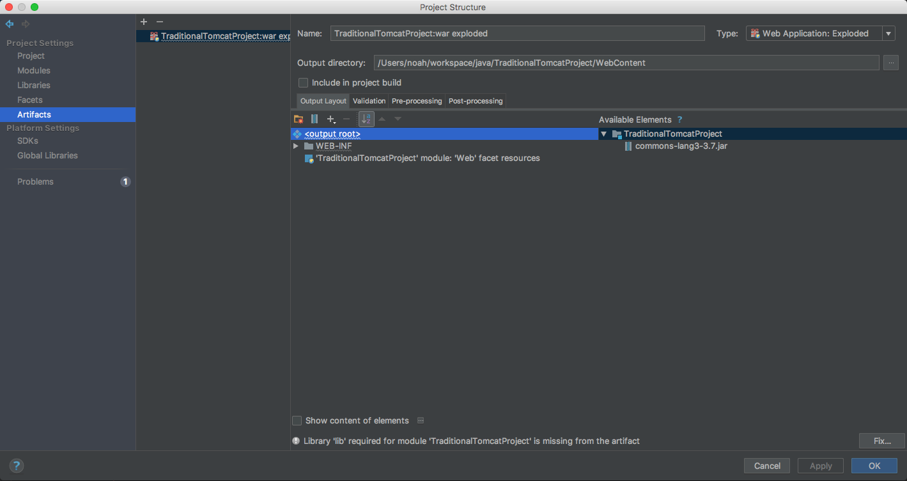

# IntelliJ IDEA Import Traditional Tomcat Project

舊型 JAVA Web 專案，如沒使用 Maven/Gradle 控管，要改用 IntelliJ 開發時時手動設定相關專案屬性

* [資料夾結構](#folder)
* [基本設定](#basic)
* [Tomcat設定](#tomcat)
* [Maven設定](#maven)

<h2 id="folder">資料夾結構</h2>
以下範例，會保留此資料結構，讓 Eclipse & IntelliJ IDEA 併存使用

    ├── WebContent
    │   ├── META-INF
    │   └── WEB-INF
    │       ├── classes
    │       │   └── tw
    │       │       └── noah
    │       │           └── example
    │       └── lib
    ├── doc
    └── src
        └── tw
            └── noah
                └── example

<h2 id="basic">基本設定</h2>
> IntelliJ IDEA > File > Project Structure

1. 設定 JDK

2. 設定 Module，指定 Java Source , 如 IDEA 沒識別到，需手動指定

3.設定要編譯後的類別綁放路徑，如果與 Eclipse 需同時存在，則可放到如下圖: WebContent/WEB-INF/classes

4.設定相關Java LIB(*.jar)，如 專案下的(WEB-INF/lib)、tomcat lib，及自己手動放進 tomcat/lib 下的。自己手動放進 tomcat/lib 下的 library, 需調整 scope 為 `Provided`

5.設定 web.xml 及程式根路徑(WebContent)

6.設定程式根路徑(WebContent)

<h2 id="tomcat">Tomcat設定</h2>

1.新增TomcatServer

2.新增部署後的context

<h2 id="maven">Maven設定</h2>

如果使用 IntelliJ IDEA 無 Tomcat 功能，則可用 Maven 方式附掛 Tomcat 執行

並且手動撰寫 maven 說明檔 : [pom.xml](pom.xml)

